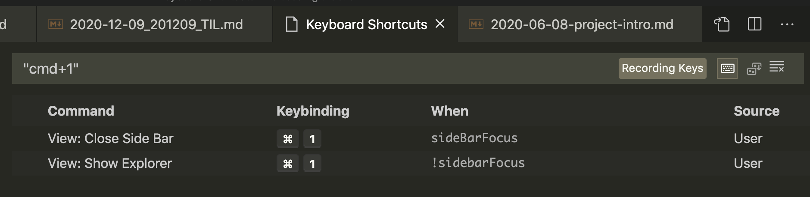

## 몫 구하기 - 시프트(>>) 연산

비트를 왼쪽에서 오른쪽으로 이동시키는 `>>` 연산자를 사용하면 나눗셈 몫을 구할 수 있다.  
**비트를 왼쪽 -> 오른쪽으로 1비트 이동할 때마다 2로 나누는 연산**과 같다.  
4로 나눈 몫 = `>>` 2비트 이동  
8로 나눈 몫 = `>>` 3비트 이동  

```java
  public class TmpTest {
      @Test
      public void 시프트연산자로몫구하기() {
          int divisor = 4; //제수 - 나누는 수
          int dividend = 8; //피제수 - 나누어지는 수
          int quotient, remainder; //몫과 나머지

          quotient = dividend >> (divisor / 2); // dividend를 divisot로 나눈 몫
          int expected = 2;
          assertEquals(expected, quotient);
      }

      @Test
      public void 시프트연산자로몫구하기2() {
          int divisor = 8; //제수 - 나누는 수
          int dividend = 16; //피제수 - 나누어지는 수
          int quotient, remainder; //몫과 나머지

          quotient = dividend >> (3); // dividend를 divisot로 나눈 몫. 8 = 2^3이므로 3번 시프트 연산
          int expected = 2;
          assertEquals(expected, quotient);
      }
  }
  ```

---

## 나머지 구하기 - 비트 AND 연산  
2로 나눈 나머지 값은 해당 메모리의 마지막 2비트 값만 사용하면 된다.  
4로 나눈 나머지 == 마지막 2비트  
8로 나눈 나머지 == 마지막 3비트  
16로 나눈 나머지 == 마지막 4비트  

8비트 메모리에 있는 값을 4로 나눈 나머지를 구하려면 다음과 같이 비트 AND 연산을 수행  

```
  xxxx xxxx //대상 값의 8비트 표현
& 0000 0011 //0x03 AND 연산 //알아내려는 마지막 비트 수 n만큼만 1로 해서 연산하면됨
------------
  0000 00xx //1과 AND 연산한 비트만 자신의값 그대로로 남아있다.
```

이렇게 0x03으로 비트 AND 연산을 하면 기존 값에서 마지막 2비트만 사용가능하기 때문에 0~3 사이의 값만 남게된다. 즉 4(피제수)로 나눈 나머지 값을 구하고 싶다면 `4(피제수)-1 = 3` 값으로 비트 AND 연사을 하면된다.
```java
remainder = dividend & (divisor - 1)
```

ex)
`X & 65535` : 65535와 and하면 그것이 곧 65536으로 나눈 나머지

---

## VSCode shortcut 편집

VSC에서 Intellij 키바인딩과 VIM을 쓰면서 여러 단축키가 섞였다.  
sidebar 열고 닫는 단축키를 `cmd+1`로 사용하기 위해서 다음과 같이 셋팅  
`when`에 어디에 포커스되어있을 때 키가 적용되도록할지 설정할 수 있다.  
sideBar에 포커스가 되어있다면 `cmd+1`로 사이드바를 닫고, sideBar에 포커스되어있지 않다면 `cmd+1`로 사이드바를 연다.  



- `when`에 어떤 컨텍스트를 넣어야할지는 [VSCode 키바인딩 Docs](https://code.visualstudio.com/docs/getstarted/keybindings#_when-clause-contexts)에서 확인할 수 있다.

---

## [마크다운] - image file 경로에 공백이 있는 경우

공백을 `%20`로 인코딩하면 된다.

- [Q.Spaces in path to image file](https://github.com/alanshaw/markdown-pdf/issues/54)
