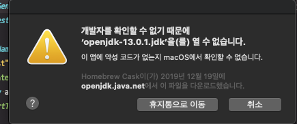
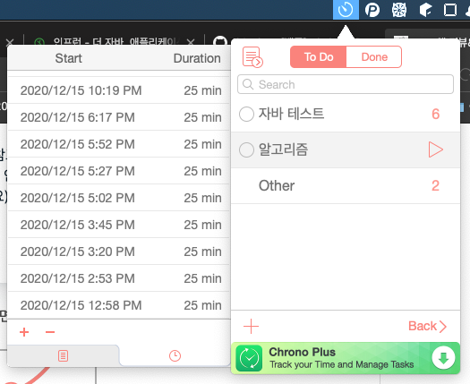
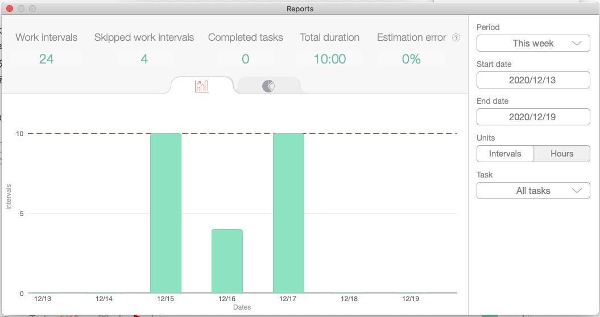

**IntelliJ ShortCut**
* 테스트 코드 작성 : `cmd + shift + t`

---

## Maven 으로 JAR 실행 시 오류

개발자 확인 불가로 열수 없음

[보안 및 개인정보보호] > [일반] 에서 해당 앱을 허용해주면 된다.

---

## Be Focused 활용기

Duration을 지정하고 학습을 진행하니깐 집중이 잘 된다. 집에서는 적극 활용해야지

