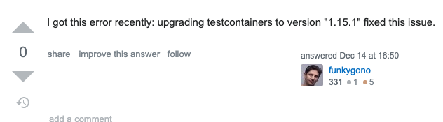
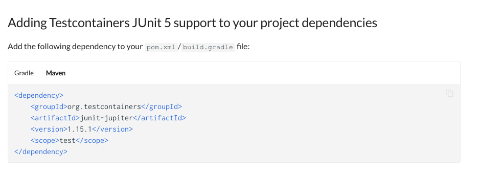
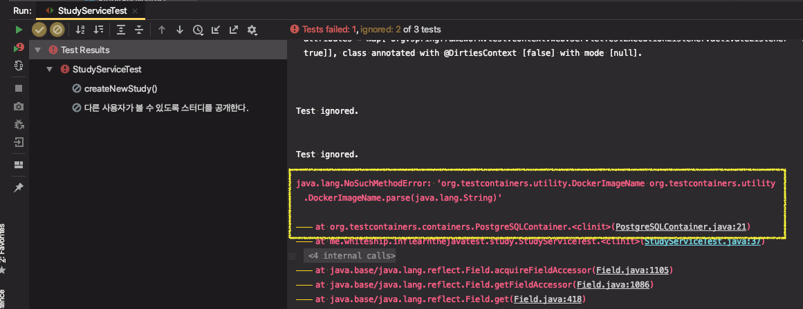

## [Testcontainers] Error - 설치 시

* 에러메시지

```
Caused by: com.github.dockerjava.api.exception.NotFoundException: {"message":"No such image: quay.io/testcontainers/ryuk:0.2.3"}
```

```
java.lang.NoSuchMethodError: org.testcontainers.utility.DockerImageName.parse(Ljava/lang/String;)
```

* [해결 답변](https://stackoverflow.com/questions/61887363/testcontainers-cant-pull-ryuk-image-quay-io-is-not-reachable)

  testcontainers 1.15.1 버전에서 고쳐졌으므로 버전 업그레이드

  

* [docs 참고](https://www.testcontainers.org/test_framework_integration/junit_5)





* 해결

  testcontainers junit5 지원모듈 버전과 postgresql 버전을 최신버전으로 변경해줬더니 잘 됨. (이전에 `1.13.0` 버전이었음)

---


## [Testcontainers] Error - withExposedPorts() 포트매핑 에러

`withExposedPorts(포트번호)`만 지정한 경우 포트가 매핑이 안되고 테스트에 실패함

* 오류메시지

  ```
  // 계속 시도 중인 것 처럼 무한 출력
  12:58:36.072 [ducttape-0] DEBUG org.testcontainers.shaded.com.github.dockerjava.core.command.AbstrDockerCmd - Cmd: e17cb9b0424afd5f3f5466f3747fc4fee31d6a3809b14c6ad789266def7fa221,<null>,true,true,<null>,<null>,<null>,{/bin/sh,-c,true &&  (cat /proc/net/tcp* | awk '{print $2}' | grep -i ':0*1e61' || nc -vz -w 1 localhost 7777 || /bin/bash -c '</dev/tcp/localhost/7777') &&  (cat /proc/net/tcp* | awk '{print $2}' | grep -i ':0*1538' || nc -vz -w 1 localhost 5432 || /bin/bash -c '</dev/tcp/localhost/5432')},<null>,<null>
  ```

  ```
  org.testcontainers.containers.ContainerLaunchException: Container startup failed
  
  	at org.testcontainers.containers.GenericContainer.doStart(GenericContainer.java:330)
  	at org.testcontainers.containers.GenericContainer.start(GenericContainer.java:311)
  ```

  검색 - "genericcontainer with exposed ports error"

* [해결 답변](https://github.com/testcontainers/testcontainers-java/issues/1978)

* 해결

  > 대기 전략을 재정의하면 효과가 있습니까? 포트 검사 전략이 컨테이너 내부에서 포트를 확인하는 일부 임원을 실행하므로 포트 검사 전략으로 인해 발생한 것 같습니다.

  포트 대기 코드 추가 - `.waitingFor()`

```java
@Container
static GenericContainer postgreSQLContainer = new GenericContainer("postgres")
  .withEnv("POSTGRES_DB", "studytest")
  .withExposedPorts(5432, 7777).waitingFor(new WaitStrategy() {
  @Override
  public void waitUntilReady(WaitStrategyTarget waitStrategyTarget) {

  }

  @Override
  public WaitStrategy withStartupTimeout(Duration startupTimeout) {
    return null;
  }
});
```

