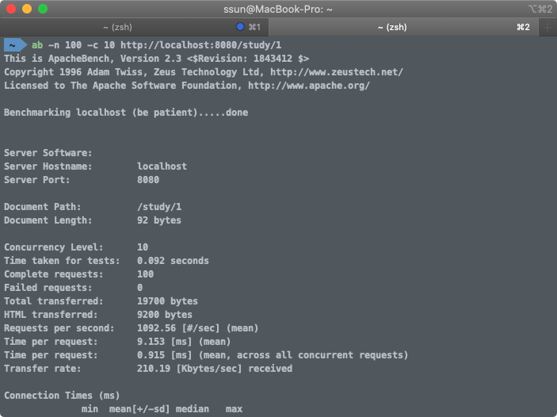
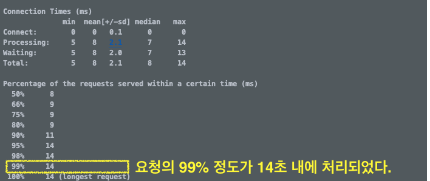

## [HTTPie] http client 유틸리티

[httpie](https://github.com/jkbrzt/httpie)  : python 으로 개발된 콘솔용 http client 유틸리티

1. curl 에 비해 사용이 쉬움 - 직관적인 명령행 문법
2. JSON 타입 지원
3. 결과에 대한 포멧팅 - 출력을 포맷팅하여 보여주므로 가독성이 뛰어남
4. Form 과 file 업로드가 쉬움
5. 커스텀 헤더 설정
6. HTTPS, 프록시 및 인증
7. wget과 같은 다운로드 기능
8. 다양한 OS(Linux, Mac OS X, Windows) 지원
9. 플러그인 기능
10. Python 2.6 이상 지원

 

### 설치

1. pip 설치

   ```java
   wget https://bootstrap.pypa.io/get-pip.py
   python get-pip.py
   ```

2. httpie 설치

   (안되면 root 권한으로 설치)

   ```java
   pip install --upgrade httpie
   ```


### 기본 사용

```java
http [flags] [METHOD] URL [ITEM [ITEM]]
```

- flags : 실행시 전달할 옵션으로 *–* 로 시작(Ex: *--json*)
- METHOD : HTTP 메소드로 생략시 GET.
- URL: 연결할 url

*http --help* 를 실행하면 각 플래그별 상세한 설명을 볼 수 있음.


#### Flags

* -v : 자세한 정보 출력 (request header, body 내용 출력)

* --follow : redirect. HTTP 301, 302 응답이 올 경우 해당 링크로 이동

  * --max-redirects=COUNT :  최대 redirect 횟수를 지정(기본값 30)

* --headers(-h) : Content 제외하고 Header만 출력

* --download : wget 처럼 다운로드 프로그램으로 사용

  ```sh
  http --download example.org/file
  ```


### Key-value

* Querystring : `key==value` (※ `==`을 키/값 형태로 사용)
* POST, PUT Data : `key=value`

##### JSON

```sh
http PUT example.org name=Solar email=solar@example.org
```

아래와 같이 JSON 요청으로 변환되서 전달

```http
PUT / HTTP/1.1
Accept: application/json, */*
Accept-Encoding: gzip, deflate
Content-Type: application/json
Host: example.org

{
    "name": "Solar",
    "email": "solar@example.org"
}
```

 


### SSL

#### SSL 인증서 검증 안 함

서버의 SSL 인증서에 문제가 있어서 HTTPS 통신에 문제가 있을 경우 *--verify=no* 옵션을 사용하면 인증서 검증 안함

```java
http --verify=no https://example.org
```


#### SSL CA 인증서 지정

CA 인증서가 없어서 검증 에러가 날 경우 *--verify* 옵션뒤에 CA 인증서 번들 파일을 지정하여 검증 가능

```java
http --verify=/ssl/custom_ca_bundle https://example.org
```

 

#### SSL version 

*--ssl={ssl2.3,ssl3, tls1, tls1.1, tls1.2}* 옵션으로 SSL 버전 지정

```sh
http --ssl=ssl3 https://example.org
```


### HTTP Authentication

--auth, 또는 -a 옵션 뒤에 인증 정보를 전달

```sh
http -a username:password example.org
```

암호를 커맨드에 전달하지 않을 경우 프롬프트에서 입력

```java
http -a username example.org
```

Digest auth:

```java
 http --auth-type=digest -a username:password example.org
```


##### REF

* https://www.lesstif.com/software-architect/httpie-curl-http-client-28606741.html

* https://www.popit.kr/introduce_httpie/

---

## [apache bench] HTTP 요청 처리 시간 측정

JMeter 외에 apache bench test로 성능을 측정할 수 있다.

**ab** : 아파치 웹서버 성능검사 도구

* [Docs](https://httpd.apache.org/docs/2.4/ko/programs/ab.html)

* Mac, Linux 는 기본적으로 설치되어있음

-n : 전체 요청 갯수

-c : 몇개의 쓰레드로 요청을 만들어서 전달할 것인지

```sh
ab -n 전체요청갯수 -c 쓰레드갯수 요청url
```

주는 값에 따라 결과가 달라지므로 정확한 값을 알아내기는 힘들다. 샘플링을 하면서 적절한 값을 찾아낸다. 서버가 감당할 트래픽이 어느정도 되는지 파악




100%는 엣지케이스가 많이 들어가므로 보통 쓰지않고, 99%의 결과값으로 성능을 측정한다.




