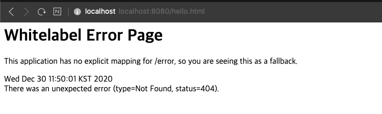
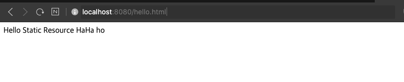
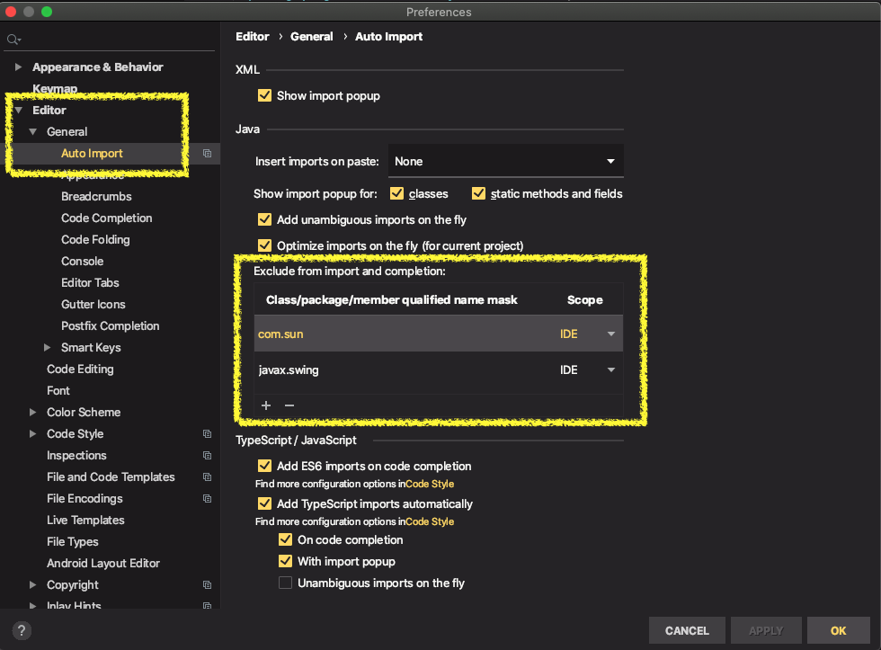

## 스부링 부트 웹 MVC에서 정적 리소스 요청 시 못 찾는 문제

* 문제

  `localhost:8080/hello.html` 요청하면 `/resource/static/hello.html` 문서가 보여져야하는데 보이지 않음

  

* 원인

  `/resource` 디렉토리가 classpath 설정이 제거돼있었다.

* 해결

  /resource` 디렉토리를 classpath에 추가해줌

  [classpath 설정하는 방법]({{ site.baseurl }})

  

---

## jekyll markdown 내부 링크
`link` 태그를 사용하여 게시물 이외의 페이지에 연결할 수 있다. 
* link는 게시물, 페이지, 컬렉션의 문서 및 파일에서 작동
* link 태그를 사용할 때 파일 확장자를 포함시켜야 함  

```tex
(* 예시에서 `\`는 제외)
[Link to a document]({{ site.baseurl }}{\% link _collection/name-of-document.md %})
[Link to a post]({{ site.baseurl }}{\% link _posts/2016-07-26-name-of-post.md %})
[Link to a page]({{ site.baseurl }}{\% link news/index.html %})
[Link to a file]({{ site.baseurl }}{\% link /assets/files/doc.pdf %})
```


## IntelliJ Import static method... 에 원하는 패키지가 나오지 않을 때

* 문제

  MockMVC의 get 메서드를 임포트하려는데 원하는 패키지가 목록에 없다.

* 원인

  get 메서드가 흔하게 쓰이는 이름으로 auto import되는 패키지가 많아서 목록에 보이지 않은 것.

* 해결

  Auto Import 되는 패키지에서 불필요한 패키지를 제외시키도록 설정에 추가함



| 제외한 패키지명         |      |
| ----------------------- | ---- |
| javax.swing             | IDE  |
| jdk.nashorn             | IDE  |
| org.hibernate.validator | IDE  |
| sun.font                | IDE  |
| sun.jvm                 | IDE  |
| sun.security            | IDE  |
| sun.swing               | IDE  |
| com.sun                 | IDE  |
